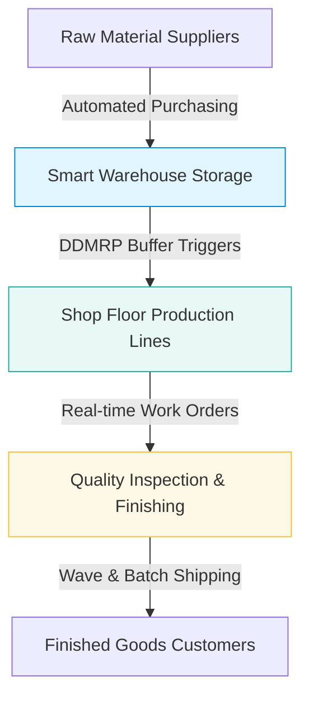
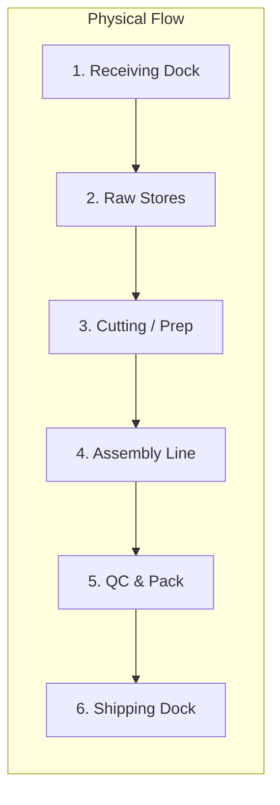
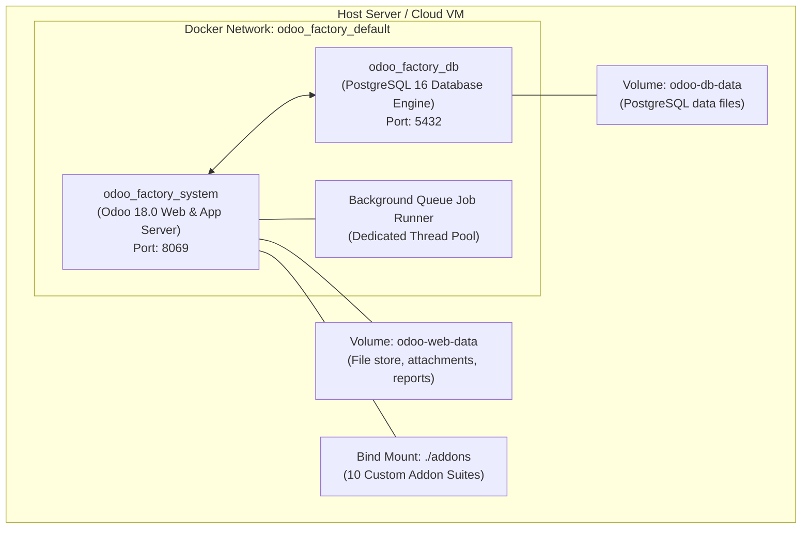
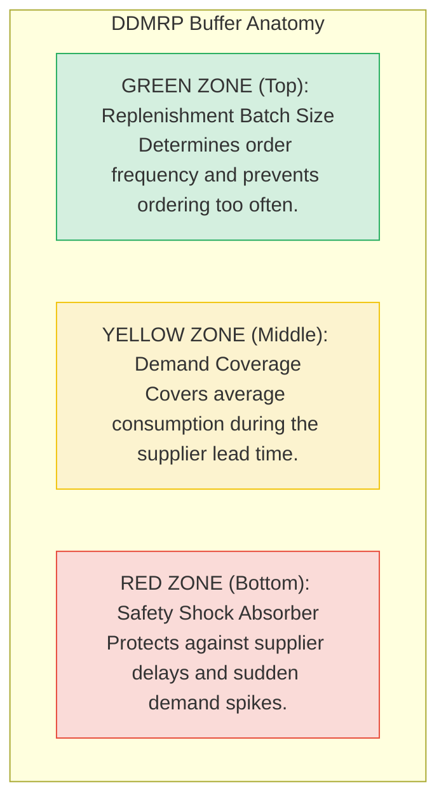
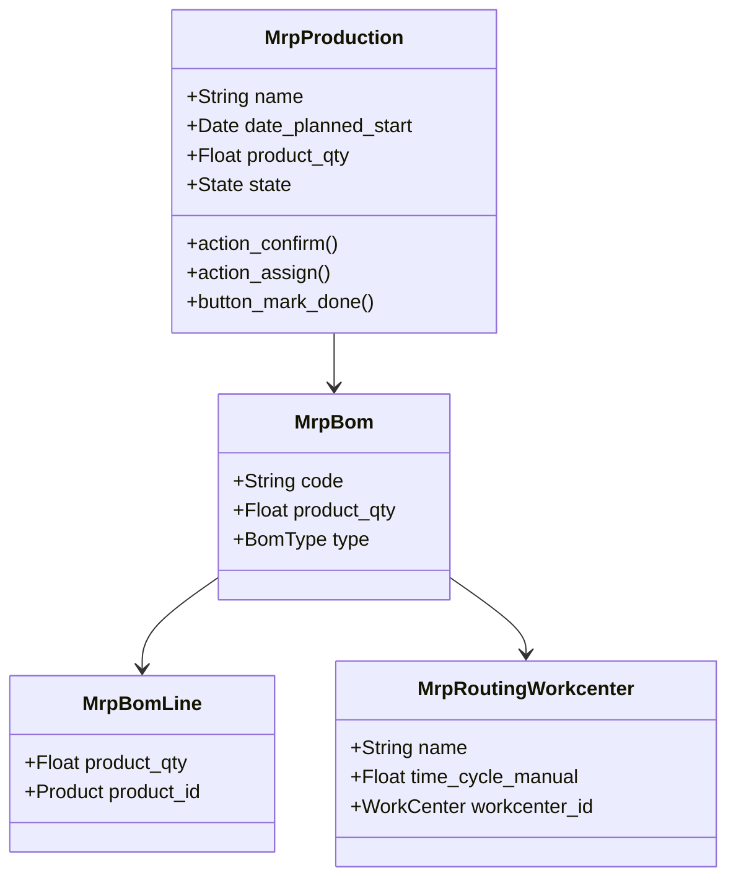
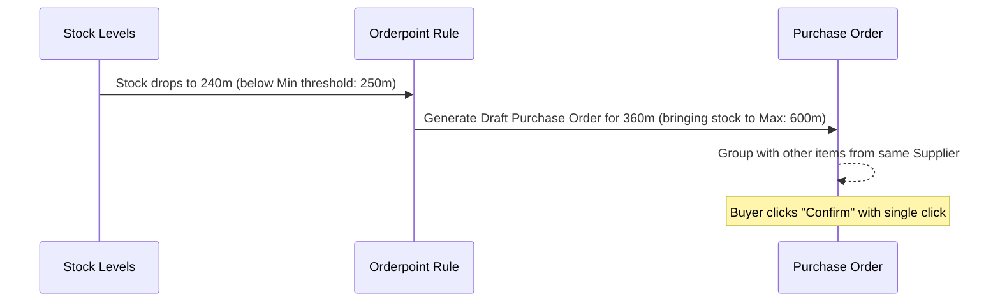
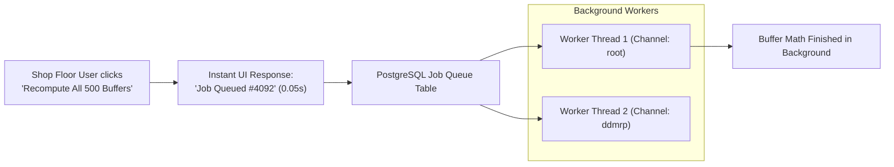
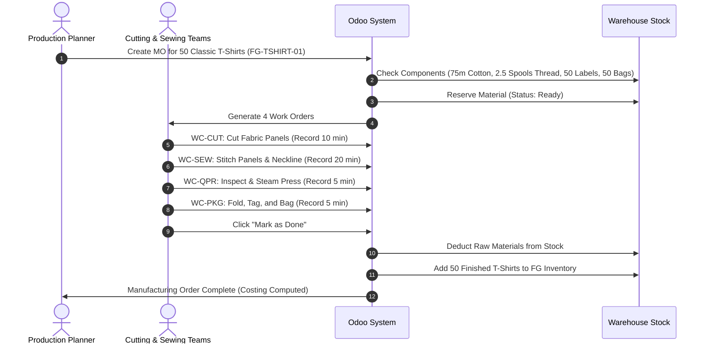

# 🏭 Odoo Factory Enterprise Manual
## A Comprehensive 20-Page Guide to Modern Manufacturing & Supply Chain Management
**Target Audience**: Factory Owners, Operations Managers, Plant Directors, and Non-Technical Teams  
**Platform**: Odoo 18.0 Community + OCA Enterprise Addon Suites  
**Version**: 1.0 (2026 Edition)  
**Author**: Odoo Factory Engineering  

---

## 📑 Table of Contents (The 20 Pages)

- [Page 1: Executive Summary & The Vision of a Digital Factory](#page-1-executive-summary--the-vision-of-a-digital-factory)
- [Page 2: The Anatomy of a Modern Manufacturing Plant](#page-2-the-anatomy-of-a-modern-manufacturing-plant)
- [Page 3: Factory Jargon Buster & Plain-English Glossary](#page-3-factory-jargon-buster--plain-english-glossary)
- [Page 4: System Architecture & Infrastructure (Docker, Postgres, Odoo)](#page-4-system-architecture--infrastructure-docker-postgres-odoo)
- [Page 5: Why Traditional Factories Fail: The Bullwhip Effect & MRP Flaws](#page-5-why-traditional-factories-fail-the-bullwhip-effect--mrp-flaws)
- [Page 6: Deep Dive: The DDMRP Suite (`addons/ddmrp`)](#page-6-deep-dive-the-ddmrp-suite-addonsddmrp)
- [Page 7: Deep Dive: Advanced Manufacturing (`addons/manufacture`)](#page-7-deep-dive-advanced-manufacturing-addonsmanufacture)
- [Page 8: Deep Dive: Work Centers & Shop Floor Operations](#page-8-deep-dive-work-centers--shop-floor-operations)
- [Page 9: Deep Dive: Warehouse & Location Management (`addons/stock-logistics-warehouse`)](#page-9-deep-dive-warehouse--location-management-addonsstock-logistics-warehouse)
- [Page 10: Deep Dive: Procurement & Automated Orderpoints (`addons/stock-logistics-orderpoint`)](#page-10-deep-dive-procurement--automated-orderpoints-addonsstock-logistics-orderpoint)
- [Page 11: Deep Dive: Inventory Workflows & Dispatch (`addons/stock-logistics-workflow`)](#page-11-deep-dive-inventory-workflows--dispatch-addonsstock-logistics-workflow)
- [Page 12: Deep Dive: Stock Availability & Priority Reservation (`addons/stock-logistics-availability`)](#page-12-deep-dive-stock-availability--priority-reservation-addonsstock-logistics-availability)
- [Page 13: Deep Dive: Background Queue Workers (`addons/queue`)](#page-13-deep-dive-background-queue-workers-addonsqueue)
- [Page 14: Deep Dive: Modern Responsive UI & Visual Timelines (`addons/web`)](#page-14-deep-dive-modern-responsive-ui--visual-timelines-addonsweb)
- [Page 15: Deep Dive: Enterprise Server Utilities & Security (`server-backend` & `server-tools`)](#page-15-deep-dive-enterprise-server-utilities--security-server-backend--server-tools)
- [Page 16: End-to-End Case Study: The Clothing & Apparel Factory](#page-16-end-to-end-case-study-the-clothing--apparel-factory)
- [Page 17: Role Guide: Production Planner & Plant Director](#page-17-role-guide-production-planner--plant-director)
- [Page 18: Role Guide: Warehouse Supervisor & Procurement Officer](#page-18-role-guide-warehouse-supervisor--procurement-officer)
- [Page 19: Role Guide: Shop Floor Operator & Quality Inspector](#page-19-role-guide-shop-floor-operator--quality-inspector)
- [Page 20: Digital Transformation Roadmap, Open-Source Rights ($0 Cost), & Maintenance](#page-20-digital-transformation-roadmap-open-source-rights-0-cost--maintenance)

---

# Page 1: Executive Summary & The Vision of a Digital Factory

### The Challenge of Manufacturing Today
Every factory, regardless of whether it produces garments, automobiles, furniture, or food, faces the same fundamental challenge: **synchronizing the flow of materials with the flow of demand**.

When a factory relies on paper tickets, disconnected spreadsheets, and verbal instructions:
1. **Material shortages stop production**: A $100 jacket cannot be finished because a $0.05 zipper is missing.
2. **Cash is trapped in dead inventory**: Warehouses overflow with raw materials that won't be needed for months.
3. **Deadlines are missed**: Production planners cannot answer a simple customer question: *"When will my order ship?"*
4. **Scrap and errors go unnoticed**: Defective parts are discovered only after thousands of units have been assembled.

### What This Project Solves
This project (`odoo_factory`) is an enterprise-grade digital operating system engineered specifically for manufacturing plants. It brings together **Odoo 18** and **10 specialized addon suites (388+ industrial modules)** from the Odoo Community Association (OCA).



### Key Business Outcomes
- **Zero Surprise Stockouts**: Decoupled stock buffers act like shock absorbers against supply chain delays.
- **Shop Floor Visibility**: Interactive visual Gantt charts show machine utilization and work order progress in real-time.
- **Tablet-Ready Usability**: Non-technical workers on the factory floor can record work with single-tap touchscreen interfaces.
- **100% Free & Open**: Zero software license fees, zero vendor lock-in.

---

# Page 2: The Anatomy of a Modern Manufacturing Plant

To understand how software manages a factory, we must first look at the four physical flows that occur inside every manufacturing facility:



### 1. The Inbound Flow (Procurement & Receiving)
- Trucks deliver raw materials (fabric rolls, steel bars, chemical drums, plastic pellets).
- The warehouse team performs **Receiving Inspection**: verifying packing slips, checking for damaged goods, and printing internal barcode labels.
- Goods are transferred from the receiving dock into designated **Racks, Aisles, and Bins**.

### 2. The Kitting & Staging Flow
- Before a production run starts, raw materials must be moved from general storage to the **Shop Floor Input Location**.
- This is called **kitting**: gathering all ingredients needed for a specific production batch so machine operators never have to leave their stations to search for parts.

### 3. The Transformation Flow (Shop Floor Production)
- Materials move through sequential **Work Centers** (Cutting ➔ Assembly ➔ Sewing ➔ Welding ➔ Painting).
- At each station, three things are consumed: **Materials**, **Machine Time**, and **Labor Time**.
- Scrap, waste, and off-cuts are recorded so the factory knows its true material efficiency.

### 4. The Outbound Flow (Packaging, Quality, & Dispatch)
- Finished goods are inspected against engineering tolerances.
- Products are packaged into protective boxes or polybags, tagged with shipping labels, and moved to the **Dispatch Bay**.

---

# Page 3: Factory Jargon Buster & Plain-English Glossary

Industrial manufacturing has a vocabulary of its own. Here is every term translated into plain language:

| Technical Term | Everyday Meaning | Real-World Example |
|----------------|------------------|-------------------|
| **BOM (Bill of Materials)** | The exact recipe of raw materials needed to make 1 unit of a finished product. | 1.5m Cotton + 1 Spool Thread + 1 Label = 1 T-Shirt. |
| **Multi-Level BOM** | A recipe containing ingredients that must also be manufactured first (sub-assemblies). | A bicycle needs a frame; the frame needs cut tubes and welding rods. |
| **Work Center** | A designated physical station on the factory floor with machines and operators. | "Cutting Table #1" or "Sewing Line B". |
| **Routing / Operations** | The step-by-step instructions specifying which station does what, and for how long. | Step 1: Laser Cut (10 min) ➔ Step 2: Stitch (20 min). |
| **MO (Manufacturing Order)** | The master authorization ticket telling the factory to produce a specific batch. | "Make 500 Navy Blue T-Shirts by next Thursday." |
| **WO (Work Order)** | An individual station's task within a Manufacturing Order. | "Cut 500 panels of cotton for MO #1042." |
| **Scrap** | Raw material wasted or ruined during production. | Fabric scraps trimmed away around a pattern. |
| **By-Product** | A secondary material produced unintentionally during manufacturing that still has value. | Sawdust produced in a furniture factory sold to paper mills. |
| **Lead Time** | The total time from placing an order to receiving the goods. | It takes 14 days for cotton fabric to arrive from the mill. |
| **ADU (Average Daily Usage)** | The average amount of a material the factory consumes per day. | The factory uses 50 meters of denim per day on average. |
| **Decoupling Point** | A strategic inventory cushion placed between two operations so a delay in one does not shut down the other. | Keeping cut fabric ready so sewing machines never sit idle if the cutting laser breaks down. |
| **DDMRP** | Demand Driven Material Requirements Planning: an inventory method using visual traffic lights (Red/Yellow/Green) to trigger replenishment. | Like a gas gauge in a car: fill up when reaching Yellow, panic when reaching Red. |

---

# Page 4: System Architecture & Infrastructure (Docker, Postgres, Odoo)

This system is built as an isolated, containerized micro-architecture designed for 24/7 reliability on the factory floor:



### Container Specifications
1. **`odoo_factory_system` (Application Tier)**:
   - **Base Image**: Official `odoo:18.0`.
   - **Addon Directories**: 10 separate suite directories mounted into `/mnt/extra-addons/...`.
   - **Auto-Initialization**: Pre-configured command automatically mounts `queue_job`, updates the schema, and executes database maintenance on boot.
2. **`odoo_factory_db` (Data Tier)**:
   - **Base Image**: `postgres:16`.
   - **Storage**: Persistent Docker volume (`odoo-db-data`) ensuring zero data loss across container updates.
3. **The Asynchronous Queue Runner (`queue_job`)**:
   - Heavy industrial calculations (recomputing 500 stock buffers, planning 1,000 work orders) are offloaded to background threads so the web browser never hangs or freezes.

---

# Page 5: Why Traditional Factories Fail: The Bullwhip Effect & MRP Flaws

To understand why this system includes **DDMRP**, one must understand why traditional MRP software causes factories to bleed money.

### The Bullwhip Effect Explained
In traditional manufacturing, small fluctuations in customer demand create massive, distorted spikes as signals travel upstream:

```
Customer Orders:    [ 100 units ]  ➔ Slight variation (+10%)
Retail Store:       [ 120 units ]  ➔ Adds buffer (+20%)
Distributor:        [ 160 units ]  ➔ Adds safety stock (+33%)
Factory:            [ 250 units ]  ➔ Overproduces (+56%)
Raw Material Mill:  [ 500 units ]  ➔ Massive overstock (+100%)
```

When customer demand drops slightly the following month, the factory is left with hundreds of thousands of dollars of unsellable raw materials.

### The Two Extreme Failure Modes of Traditional Factories
```
    [ Bimodal Inventory Distribution ]
           
      SHORTAGES                  SURPLUS
    (Deadlines Missed)       (Cash Trapped)
         ▲                         ▲
         │                         │
     ┌───┴───┐                 ┌───┴───┐
     │ 30%   │                 │ 60%   │
     │ Items │                 │ Items │
     └───┬───┘                 └───┬───┘
         │                         │
         └───────────┬─────────────┘
                     │
               OPTIMAL ZONE
              (Only 10% here!)
```

- **30% of materials are in chronic shortage**: The factory is constantly expediting parts, paying rush courier fees, and shutting down lines.
- **60% of materials are in massive surplus**: Cash is tied up in materials that won't be used for 6 months.
- **Only 10% of inventory is in the sweet spot!**

DDMRP solves this by creating **Decoupled Shock Absorbers** (Buffers) that dampen the bullwhip effect and compress lead times.

---

# Page 6: Deep Dive: The DDMRP Suite (`addons/ddmrp`)

The **Demand Driven MRP** suite (`addons/ddmrp`) is the brain of this factory installation. It replaces arbitrary guesswork with mathematically calculated visual buffers.



### How the Buffer Math Works
1. **Red Zone (Safety Cushion)**:
   $$\text{Red Zone} = \text{Lead Time} \times \text{ADU} \times \text{Lead Time Factor} \times \text{Variability Factor}$$
   - If a fabric supplier takes 10 days to deliver and has high delivery unreliability, the red zone automatically expands to protect production.
2. **Yellow Zone (Primary Coverage)**:
   $$\text{Yellow Zone} = \text{Lead Time} \times \text{Average Daily Usage (ADU)}$$
   - Represents the exact amount of stock consumed while waiting for a replenishment order to arrive.
3. **Green Zone (Order Frequency)**:
   $$\text{Green Zone} = \max(\text{Minimum Order Qty}, \text{Order Cycle Days} \times \text{ADU})$$
   - Dictates how much you should order when the trigger fires, preventing high transaction costs.

### What We Use from This Suite
- `ddmrp`: Core buffer model (`stock.buffer`), net flow equations, and planning charts.
- `ddmrp_history`: Tracks buffer status over time to detect chronic shortages before they cause downtime.
- `stock_buffer_capacity_limit`: Prevents ordering more material than physical warehouse shelving can hold.
- `ddmrp_warning_as_job`: Offloads buffer recalculations to background queue workers so the system runs fast.

---

# Page 7: Deep Dive: Advanced Manufacturing (`addons/manufacture`)

The `addons/manufacture` suite provides the industrial-grade features that modern factories need beyond basic assembly:



### Key Modules Used for Factories
1. **`mrp_production_date`**:
   - Calculates the exact start and finish dates of every order based on machine capacity, rather than optimistic manual guessing.
2. **`mrp_bom_attribute_match`**:
   - Allows a single master recipe (BOM) to automatically adapt based on product variants (e.g., using 1.5m fabric for Size M, but 1.8m for Size XL).
3. **`mrp_lot_number_propagation`**:
   - Ensures that raw material lot numbers (e.g., Fabric Roll #842) are permanently linked to the finished garment serial numbers for 100% traceability.
4. **`mrp_multi_level`**:
   - Handles deep hierarchical manufacturing trees where sub-assemblies must be built in advance.
5. **`mrp_subcontracting`**:
   - Manages outside contractors (e.g., sending cut fabric to an external embroidery shop and receiving finished embroidered panels back).

---

# Page 8: Deep Dive: Work Centers & Shop Floor Operations

A **Work Center** represents a physical workstation, machine, or human assembly team. Managing work centers effectively determines whether a factory makes a profit.

### The 4 Core Metrics of Every Work Center
1. **Capacity (`default_capacity`)**: How many units the station can process simultaneously (e.g., a laser cutter can cut 2 sheets at once).
2. **Time Efficiency (`time_efficiency`)**: The actual speed of your workers compared to standard engineering estimates (e.g., 90% efficiency means a 10-minute task takes 11.1 minutes).
3. **Cost Per Hour (`costs_hour`)**: The financial cost of running the station (machinery depreciation + electricity + operator hourly wages).
4. **Setup & Teardown Time (`time_start` / `time_stop`)**: Time required to calibrate machines or clean stations between batches.

### Visualizing Shop Floor Capacity
```
Time:      08:00    09:00    10:00    11:00    12:00    13:00    14:00    15:00
WC-CUT:   [ MO/001: Cutting ][  MO/002: Cutting  ][ LUNCH ][ Maintenance ]
WC-SEW:            [   MO/001: Sewing   ][   MO/002: Sewing   ][ LUNCH ]
WC-QPR:                     [ MO/001: QC ][ MO/002: QC ]
WC-PKG:                              [ MO/001: Pack ][ MO/002: Pack ]
```

By connecting work orders to visual timelines, planners immediately spot bottlenecks (e.g., when the Sewing Line is overwhelmed while the Packaging Station sits idle).

---

# Page 9: Deep Dive: Warehouse & Location Management (`addons/stock-logistics-warehouse`)

A disorganized warehouse kills factory efficiency. The `stock-logistics-warehouse` suite organizes physical space into a logical digital hierarchy.

### The Location Hierarchy
```
Factory Premises (WH)
 ├── Inbound Receiving Area (WH/Input)
 ├── Raw Materials Warehouse (WH/Stock/Raw)
 │    ├── Row A (Fabric Rolls)
 │    │    ├── Bin A-01-1 (Cotton)
 │    │    └── Bin A-01-2 (Denim)
 │    └── Row B (Trims & Notions)
 │         ├── Bin B-03-1 (Buttons)
 │         └── Bin B-03-2 (Zippers)
 ├── Shop Floor Buffer (WH/Production/Input)
 ├── Production Lines (Virtual / Output)
 └── Finished Goods Warehouse (WH/Stock/Finished)
      └── High-Bay Pallet Racking
```

### Key Modules Used from This Suite
- **`stock_location_tray` & `stock_storage_type`**: Assigns specific dimensions and weight limits to bins so heavy items are never stored on fragile shelves.
- **`stock_vertical_lift`**: Connects automated vertical storage carousel machines directly to Odoo picking lists.
- **`stock_warehouse_mgmt`**: Manages multi-warehouse networks (e.g., Main Factory, Off-site Raw Material Depository, Regional Retail Depots).

---

# Page 10: Deep Dive: Procurement & Automated Orderpoints (`addons/stock-logistics-orderpoint`)

Factories cannot afford to have buyers sitting at desks manually checking 5,000 product stock levels every morning. The `stock-logistics-orderpoint` suite automates purchasing.

### How Automated Orderpoints Work


### What We Use from This Suite
1. **`stock_orderpoint_manual_procurement`**:
   - Allows procurement managers to review and fine-tune suggested purchases before POs are officially emailed to vendors.
2. **`stock_orderpoint_move_link`**:
   - Links the specific customer order or manufacturing run directly to the purchase order that was created to fulfill it, providing end-to-end visibility.
3. **`stock_demand_estimate`**:
   - Calculates future material demand based on confirmed sales orders and historical seasonality.

---

# Page 11: Deep Dive: Inventory Workflows & Dispatch (`addons/stock-logistics-workflow`)

Moving goods inside a factory requires speed, accuracy, and clear division of labor. The `stock-logistics-workflow` suite handles physical warehouse moves.

### Advanced Picking Strategies
1. **Wave Picking**:
   - Instead of picking materials for one order at a time, workers pick items for 20 orders simultaneously in a single walk through the warehouse.
2. **Batch Picking (`stock_picking_batch_extended`)**:
   - Consolidates multiple pickings onto a single cart or forklift route, cutting warehouse travel time by up to 60%.
3. **Carrier & Route Integration (`stock_picking_group_by_partner_by_carrier`)**:
   - Automatically groups outbound finished garments by shipping carrier (e.g., DHL, FedEx, Local Fleet) and delivery date.

---

# Page 12: Deep Dive: Stock Availability & Priority Reservation (`addons/stock-logistics-availability`)

When inventory is scarce, who gets the materials? The `stock-logistics-availability` suite introduces intelligent reservation rules.

### The "Available to Promise" (ATP) Engine
Traditional systems only look at **On Hand** inventory. This system looks at **Future Inventory Flow**:

$$\text{ATP} = \text{Current On Hand} + \text{Incoming Purchase Orders} - \text{Reserved for Confirmed MOs}$$

```
Current Physical Stock:      500 m
+ Confirmed PO (arriving tomorrow): + 300 m
- Reserved for MO #101:            - 450 m
-----------------------------------------
Available to Promise (ATP):        350 m
```

- Sales reps can immediately tell a customer: *"Yes, we can start your order tomorrow because the fabric arrives in the morning."*
- High-priority orders (VIP clients or rush factory orders) can reserve materials first, preventing low-priority runs from consuming critical stock.

---

# Page 13: Deep Dive: Background Queue Workers (`addons/queue`)

A factory generates thousands of transactions daily: barcode scans, stock moves, scrap entries, and buffer calculations. If the database locks up or the browser freezes, workers on the shop floor cannot do their jobs.

### The Architecture of `queue_job`


### Why This Is Essential for Factories
- **Zero Browser Freezing**: Long-running jobs run quietly in the background.
- **Automatic Retries**: If a network glitch occurs during a barcode scan or EDI transfer, the queue automatically retries with exponential backoff.
- **Channel Throttling**: Heavy reporting tasks never slow down fast shop-floor barcode scanning.

---

# Page 14: Deep Dive: Modern Responsive UI & Visual Timelines (`addons/web`)

The factory floor is not an office. Workers wear gloves, stand at machines, and use tablets or wall-mounted touchscreens. Dense desktop menus do not work.

### 1. The Full-Screen App Drawer (`web_responsive`)
- Replaces tiny desktop dropdowns with large, thumb-friendly app icons.
- Built-in instant search: simply start typing `"Sewing"`, `"BOM"`, or `"Inventory"` to jump straight to the screen.

### 2. The Interactive Gantt Timeline (`web_timeline`)
- Visually schedules Manufacturing Orders across dates and work centers.
- Planners can drag and drop jobs to change scheduled times.

### 3. The 2D Matrix Entry Widget (`web_widget_x2many_2d_matrix`)
- In apparel, footwear, and consumer goods, entering size/color variants manually is tedious.
- This widget renders a clean spreadsheet grid inside Odoo forms:

| Color / Size | Small (S) | Medium (M) | Large (L) | XL | Total |
|--------------|-----------|------------|-----------|----|-------|
| **Black**    | 50        | 100        | 100       | 50 | **300** |
| **Navy**     | 25        | 50         | 50        | 25 | **150** |
| **White**    | 50        | 75         | 75        | 50 | **250** |

---

# Page 15: Deep Dive: Enterprise Server Utilities & Security (`server-backend` & `server-tools`)

Factory systems hold sensitive commercial data: costs, customer lists, recipes, and margins. The `server-backend` and `server-tools` suites ensure security, stability, and auditability.

### Key Enterprise Features
1. **Audit Logging (`auditlog`)**:
   - Records every change made to critical records (who modified a BOM recipe, who changed a product cost, who approved a scrap order).
2. **Database Auto-Vacuum Tuning (`database_autovacuum_tuning`)**:
   - Automatically maintains PostgreSQL database health and index performance without requiring a full-time database administrator.
3. **Restricted Deletions (`attachment_delete_restrict` & `base_model_restrict_update`)**:
   - Prevents accidental deletion of technical specifications, CAD drawings, or historical production records.

---

# Page 16: End-to-End Case Study: The Clothing & Apparel Factory

To see all these pieces work together, let us trace a complete manufacturing cycle in the pre-configured **Clothing Factory**:



---

# Page 17: Role Guide: Production Planner & Plant Director

### Daily Routine
1. **08:00 AM — Morning Dashboard Review**:
   - Open **Manufacturing ➔ Operations ➔ Manufacturing Orders**.
   - Switch to the **Timeline View** to see today's machine loading across `WC-CUT`, `WC-SEW`, `WC-QPR`, and `WC-PKG`.
2. **09:00 AM — Check DDMRP Buffers**:
   - Navigate to **DDMRP ➔ Stock Buffers**.
   - Filter by **Buffer Status = Red or Yellow**.
   - If cotton fabric is in Yellow, click **Create Procurement** to trigger an automated vendor order.
3. **11:00 AM — Capacity & Bottleneck Balancing**:
   - If the Sewing Line is overloaded, drag orders on the Timeline to shift work to second shifts or alternative work centers.
4. **04:00 PM — End-of-Day Efficiency & Cost Audit**:
   - Review the **Work Center Performance** reports to check actual labor hours versus engineering standards.

---

# Page 18: Role Guide: Warehouse Supervisor & Procurement Officer

### Daily Routine
1. **Receiving Inbound Shipments**:
   - Open **Inventory ➔ Operations ➔ Receipts**.
   - Match vendor delivery slips against open Purchase Orders.
   - Scan barcode labels and move goods from `WH/Input` to dedicated shelf locations (e.g., `Bin A-01-1`).
2. **Staging Materials for the Shop Floor**:
   - Check **Inventory ➔ Operations ➔ Delivery / Internal Transfers**.
   - Review materials reserved for today's Manufacturing Orders.
   - Execute batch pickings to deliver fabric rolls and trims to the cutting line before workers arrive.
3. **Automated Replenishment**:
   - Review the **Replenishment** dashboard.
   - Odoo presents all items that have breached their minimum safety thresholds.
   - Click **Order Once** to automatically generate vendor POs.

---

# Page 19: Role Guide: Shop Floor Operator & Quality Inspector

### Touchscreen Work Order Execution (Step-by-Step)
1. **Accessing the Workstation**:
   - Walk up to the workstation tablet at `WC-SEW` (Sewing Line).
   - Log in using your worker PIN or barcode badge.
2. **Starting a Job**:
   - The screen shows the list of jobs queued for this station.
   - Tap **Start** on the top job. The timer begins recording labor and machine time.
3. **Recording Scrap or Defects**:
   - If a needle breaks and ruins a garment panel, tap **Scrap**.
   - Enter `1` unit and select the reason: `Torn Fabric`. Odoo automatically deducts the scrap from inventory.
4. **Completing the Task**:
   - When finished stitching the batch, tap **Done**.
   - The job automatically advances to `WC-QPR` (Quality & Pressing).

---

# Page 20: Digital Transformation Roadmap, Open-Source Rights ($0 Cost), & Maintenance

### 1. The 4-Phase Factory Rollout Plan
```
Phase 1: Foundation (Weeks 1-2)
  ├── Clean Product Catalog & UoMs (Meters, Kg, Units)
  └── Standardize Warehouse Locations & Bin Labels

Phase 2: Core Manufacturing (Weeks 3-4)
  ├── Define accurate BOM recipes and standard operation times
  └── Train shop-floor supervisors on creating and closing MOs

Phase 3: DDMRP & Buffer Automation (Weeks 5-6)
  ├── Calculate ADU for top 20% critical materials
  └── Activate visual buffer alerts and automated procurement

Phase 4: Optimization & Mobile Shop Floor (Weeks 7-8)
  └── Deploy barcode scanners and tablets at all physical work centers
```

### 2. Open-Source Rights & Zero Cost Guarantee
- **License**: The addon suites are published under **LGPL-3.0** and **AGPL-3.0** by the Odoo Community Association (OCA).
- **Zero Royalties**: You can run this software for 1 factory or 100 factories without paying any license fees, user seat fees, or royalties.
- **Your Data, Your Control**: The system runs entirely on your own private infrastructure (cloud VM or on-premises server).

### 3. Backup & Maintenance Best Practices
- **Daily Automated Database Backups**:
  ```bash
  docker exec odoo_factory_db pg_dump -U odoo -Fc odoo > odoo_backup_$(date +%F).dump
  ```
- **Disaster Recovery**: Restoring the complete database takes less than 3 minutes on any server with Docker installed.
