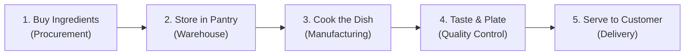
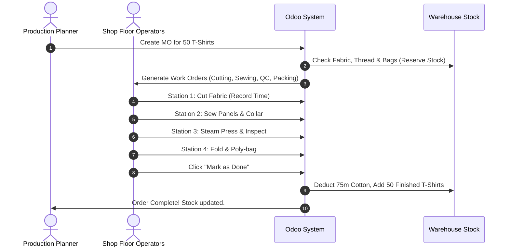

# 🏭 The Complete Beginner's Guide to Odoo Factory & Manufacturing

Welcome to your Factory Management System! This guide is written specifically for **non-developers** and anyone who has **never worked in a factory or used Odoo before**. 

Think of this document as your friendly handbook. No confusing technical jargon—just clear explanations, real-world analogies, and step-by-step instructions.

---

## 📖 Table of Contents
1. [The Big Picture: How a Factory Actually Works](#1-the-big-picture-how-a-factory-actually-works)
2. [Jargon Buster: Plain-English Glossary](#2-jargon-buster-plain-english-glossary)
3. [The Clothing Factory Setup](#3-the-clothing-factory-setup)
4. [DDMRP Explained: The Traffic Light Inventory System](#4-ddmrp-explained-the-traffic-light-inventory-system)
5. [Visual Workflows (Flowcharts)](#5-visual-workflows-flowcharts)
6. [Step-by-Step Walkthrough: Making Your First 50 T-Shirts](#6-step-by-step-walkthrough-making-your-first-50-t-shirts)
7. [How to Use the New Simplified UI](#7-how-to-use-the-new-simplified-ui)

---

## 1. The Big Picture: How a Factory Actually Works

Running a factory is essentially like running a giant, synchronized kitchen:



1. **Procurement (Buying Ingredients)**: You order raw materials (cotton fabric rolls, thread, buttons, zippers) from suppliers.
2. **Warehousing (The Pantry)**: Materials arrive at the loading dock, get counted, and are placed on warehouse shelves with barcode labels.
3. **Manufacturing (The Cooking)**: Workers follow a recipe to turn raw materials into finished garments across specialized stations (cutting, sewing, packaging).
4. **Quality Control (Inspection)**: Before anything leaves the factory, someone checks the stitching, trims loose threads, and presses the garment with steam.
5. **Shipping (Delivery)**: The finished items are boxed and shipped out to clothing stores or online buyers.

---

## 2. Jargon Buster: Plain-English Glossary

Here are the terms you will see inside Odoo, translated into everyday language:

| Odoo Term | What It Really Means | Kitchen / Cooking Analogy |
|-----------|----------------------|---------------------------|
| **Product** | Any physical item in the system (materials or finished goods). | An egg, flour, or a finished cake. |
| **BOM (Bill of Materials)** | The exact recipe list of materials needed to make 1 finished item. | The ingredient list for baking a pizza. |
| **Work Center** | A specific physical station or machine on the shop floor. | The prep counter, the oven, or the dishwashing sink. |
| **Routing / Operations** | The step-by-step instructions on what to do at each station and how long it takes. | Step 1: Chop onions (5 min). Step 2: Sauté in pan (10 min). |
| **MO (Manufacturing Order)** | The master ticket telling the factory: *"Make 100 T-Shirts by Friday"*. | A large catering order ticket pinned in the kitchen. |
| **WO (Work Order)** | An individual station's task within an MO. | The ticket for the prep cook to cut the vegetables. |
| **Stock Picking** | Moving items from one place to another (e.g., shelf to workstation). | Grabbing butter and flour from the fridge to the counter. |
| **DDMRP** | *Demand Driven Material Requirements Planning*. A smart system that prevents running out of stock without buying too much. | Keeping milk in the fridge so you never run out, but not buying 20 gallons at once. |
| **Buffer (Decoupling Point)** | A safety cushion of stock that protects the factory from delays. | Keeping an extra bag of coffee in the pantry just in case. |

---

## 3. The Clothing Factory Setup

Your system comes pre-loaded with a realistic **Apparel & Garment Factory**:

### A. Raw Materials (The Ingredients)
- **`RAW-COT-01`**: 100% Organic Cotton Fabric (Meters) — Soft, unbleached cotton roll for T-shirts.
- **`RAW-DEN-01`**: Indigo Raw Denim Fabric (Meters) — Heavyweight 13oz denim for jackets.
- **`RAW-THR-01`**: Heavy Polyester Sewing Thread (Spools) — High-tensile thread for seams.
- **`RAW-BTN-01`**: Antique Brass Shank Buttons (Pieces) — Vintage metal buttons for denim.
- **`RAW-ZIP-01`**: Metal YKK Zipper 20cm (Pieces) — Heavy-duty zippers.
- **`RAW-LBL-01`**: Woven Neck Labels & Care Tags (Pieces) — Brand tags stitched into collars.
- **`PKG-BAG-01`**: Biodegradable Poly Bag (Pieces) — Protective self-seal plastic bag.

### B. Work Centers (The Stations)
1. **`WC-CUT` — Fabric Cutting Station**: Workers unroll fabric rolls on long spreading tables and cut pattern pieces (sleeves, front, back) using precision cutters.
2. **`WC-SEW` — Assembly & Sewing Line**: Industrial sewing machines where operators stitch panels together, attach collars, and sew on buttons.
3. **`WC-QPR` — Quality Inspection & Steam Pressing**: High-pressure steam vacuum tables to remove wrinkles, verify measurements, and inspect stitching quality.
4. **`WC-PKG` — Folding & Packaging Station**: Workers fold garments, attach hang tags, insert into poly bags, and apply barcode labels.

### C. The Finished Products (Recipes)
- **Classic Organic Cotton T-Shirt (`FG-TSHIRT-01`)**:
  - *Recipe*: 1.5 meters Cotton Fabric + 0.05 Spool Thread + 1 Neck Label + 1 Poly Bag.
  - *Process*: Cutting (10 min) ➔ Sewing (20 min) ➔ QC/Pressing (5 min) ➔ Packaging (5 min).
- **Classic Denim Jacket (`FG-DENIM-01`)**:
  - *Recipe*: 2.8 meters Denim Fabric + 0.20 Spool Thread + 6 Brass Buttons + 1 Zipper + 1 Neck Label + 1 Poly Bag.
  - *Process*: Cutting (25 min) ➔ Sewing (50 min) ➔ QC/Pressing (15 min) ➔ Packaging (8 min).

---

## 4. DDMRP Explained: The Traffic Light Inventory System

Traditional factories often make two huge mistakes:
1. **They run out of crucial parts** (e.g., no buttons = all denim jackets stop).
2. **They overbuy materials** (millions of dollars tied up sitting in a warehouse collecting dust).

**DDMRP (Demand Driven MRP)** fixes this using a **Traffic Light Buffer**:

```
+-------------------------------------------------------------+
| GREEN ZONE (Top)     - Safe! Do not order yet.              |
|                        Recommended order batch size.        |
+-------------------------------------------------------------+
| YELLOW ZONE (Middle) - Reorder Trigger! Time to buy/make.   |
|                        Covers usage while waiting for delivery.|
+-------------------------------------------------------------+
| RED ZONE (Bottom)    - Safety Cushion! Danger of stockout.  |
|                        Absorbs unexpected spikes in demand.  |
+-------------------------------------------------------------+
```

- When inventory drops into **Yellow**, Odoo automatically alerts you: *"Time to reorder 200 meters of cotton!"*
- If inventory reaches **Red**, it flags as high priority so you don't shut down the factory.

---

## 5. Visual Workflows (Flowcharts)

### Complete Lifecycle: From Cotton Roll to Packaged T-Shirt



---

## 6. Step-by-Step Walkthrough: Making Your First 50 T-Shirts

Ready to try it yourself? Follow these simple steps in your web browser:

### Step 1: Open Odoo
1. Open your browser and navigate to: `http://localhost:8069`
2. Log in (Default credentials: `admin` / `admin` or as configured).

### Step 2: Open the Manufacturing App
1. Click the **App Drawer icon** (the 9-dots grid in the top left corner).
2. Click on **Manufacturing** (icon with gears).

### Step 3: View the Sample Orders
1. You will see the list of Manufacturing Orders.
2. Look for `MO/00001` (T-Shirts) or `MO/00002` (Denim Jackets).
3. Click on any order to open its details. Notice:
   - **Components tab**: Shows the recipe of materials reserved.
   - **Work Orders tab**: Shows the 4 stations (Cutting ➔ Sewing ➔ Quality ➔ Packaging).

### Step 4: Start and Complete a Work Order
1. Click the **Work Orders** tab.
2. Click **Start** next to `Pattern & Panel Cutting`. The timer begins!
3. When finished cutting, click **Done**.
4. The system automatically moves the job to the next station: `Assembly & Sewing Line`!

### Step 5: Check the Finished Goods in Stock
1. Click the **App Drawer** ➔ **Inventory**.
2. Go to **Products** ➔ **Products**.
3. Search for `Classic Organic Cotton T-Shirt`.
4. You will see the **On Hand** quantity increase!

---

## 7. How to Use the New Simplified UI

We have upgraded the interface to make it clean and easy to use on both computers and tablets:

1. **The App Drawer (`web_responsive`)**:
   - Instead of messy, confusing menus across the top, click the grid icon in the top-left corner.
   - A clean, full-screen menu opens. You can start typing immediately (e.g., type *"Sew"* or *"Stock"*) to jump directly to what you need.

2. **The Visual Timeline (`web_timeline`)**:
   - Inside Manufacturing, look for the **Timeline** view icon in the top-right corner (next to List and Kanban).
   - This opens a Gantt-style schedule showing each station's work orders over time. You can drag and drop jobs to reschedule them!

3. **Sticky Columns**:
   - Long tables now keep their column headers visible when you scroll down, so you never lose your place.

---

### Need Help?
- **Raw Materials Missing?** Check the **Inventory** app ➔ **Operations** ➔ **Replenishment**.
- **Questions about DDMRP?** Open the **DDMRP** menu to view the traffic light buffer charts.
